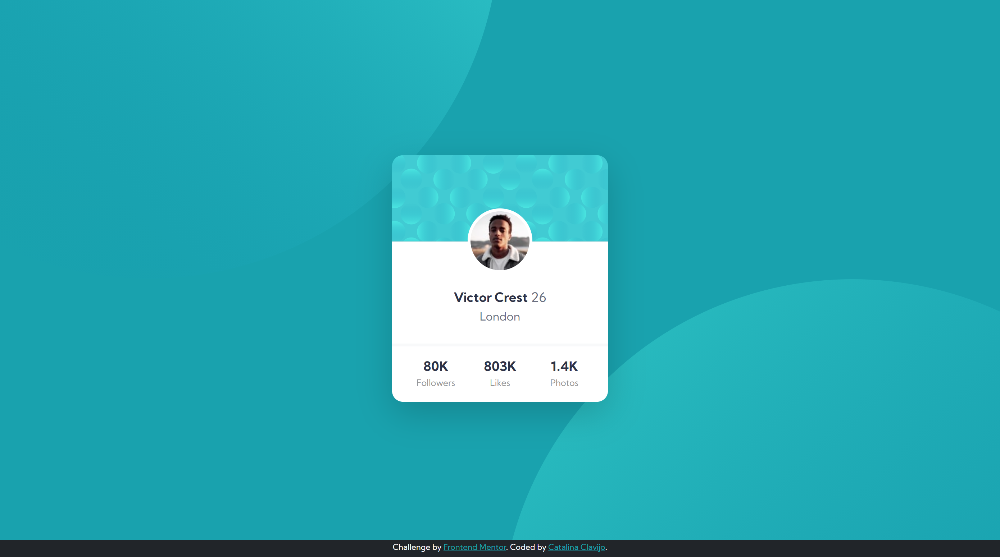
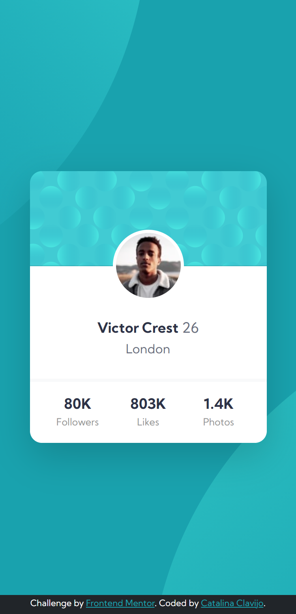

# Frontend Mentor - Profile card component
## HTML - CSS - Bootstrap Responsive

This is a solution to the [Profile card component challenge on Frontend Mentor](https://www.frontendmentor.io/challenges/profile-card-component-cfArpWshJ).

## Screenshot

### Desktop

### Mobile

### Links

- Solution URL: [https://github.com/Cataclas/Frontend-Mentor_Profile-card-component](https://github.com/Cataclas/Frontend-Mentor_Profile-card-component)
- Live Site URL: [https://cataclas.github.io/Frontend-Mentor_Profile-card-component/](https://cataclas.github.io/Frontend-Mentor_Profile-card-component/)

## Built with

- Semantic HTML5 markup
- [CSS custom properties](https://devdocs.io/css/)
- [Bootstrap v5.0](https://getbootstrap.com/docs/5.0/getting-started/introduction/)
- Flexbox
- Responsive

## Author

- Frontend Mentor - [@Cataclas](https://www.frontendmentor.io/profile/Cataclas)
- GitHub - [Cataclas](https://github.com/Cataclas)
